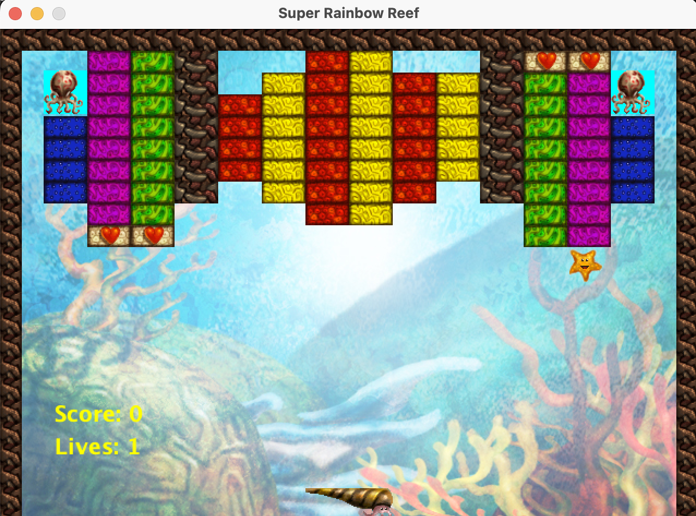

# Super Rainbow Reef

## Objective
* Destroy all big legs
* Health power ups gives Katch more lives

## Controls
* Move left : left arrow key
* Move right : right arrow key

## How to build with intelliJ
1. Set up project structure (File -> Project structure)
2. In the artifacts tab, select JAR and from modules with dependencies
3. Select the main class and apply all changes
4. Build the project
5. Build artifacts 
6. Run the jar

